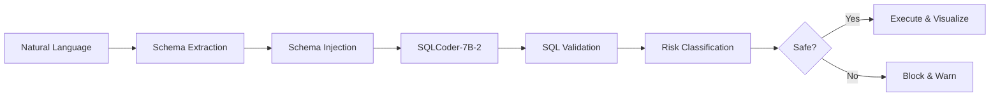
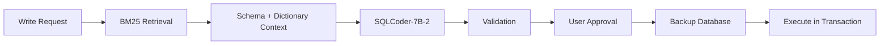

# 🔮 NL2SQL Assistant

[](https://nl-to-sql-assistant.streamlit.app/)
[](https://www.python.org/downloads/)
[](https://opensource.org/licenses/MIT)
[](https://huggingface.co/defog/sqlcoder-7b-2)

**A schema-aware Natural Language to SQL system with multi-layer safety controls, built for production-oriented AI engineering.**

Transform natural language questions into SQL queries using HuggingFace's SQLCoder-7B-2. Schema injection constrains generation to valid tables and columns; AST-based validation and risk classification enforce safety before execution.

🌐 **[Live Demo](https://nl-to-sql-assistant.streamlit.app/)**

---

## ✨ Key Features

### 🎯 **Three Intelligent Modes**

| Mode | Description | Safety Level |
|------|-------------|--------------|
| **📊 DB-Aware Query** | Ask questions about your connected database with schema-grounded generation | 🟢 SELECT-only, Auto-validated |
| **✍️ Write Mode** | Generate INSERT/UPDATE/DELETE with RAG-based context and explicit approval | 🔴 Human-in-the-loop required |
| **🌐 Generic SQL** | Draft SQL for any dialect (SQLite, PostgreSQL, MySQL) without execution | 🟡 No execution (safe) |

### 🛡️ **Safety Controls (Implemented)**

- ✅ **Schema Injection** - Generation constrained to actual tables/columns; no hallucinated identifiers
- ✅ **AST-Based Validation** - SQL parsed and validated before execution; blocks dangerous operations
- ✅ **Risk Classification** - Every query assessed Low/Medium/High before execution
- ✅ **SELECT-Only Enforcement** - DB-Aware mode hard-blocks writes at the validation layer
- ✅ **Human-in-the-Loop** - Explicit user confirmation required before any write operation executes
- ✅ **Automatic Backups** - Database snapshot created before every destructive operation
- ✅ **Transactional Rollback** - Write mode executes in a transaction; rolls back on error

### ⚙️ **Engineering Decisions**

- **SQLCoder-7B-2** — SQL-specialized model, not a general LLM; better schema adherence out of the box
- **BM25 for RAG** — Keyword-based retrieval is deterministic and latency-free vs. embedding lookup; well-suited for structured schema/column name matching
- **Dual-Mode Architecture** — Read and Write are intentionally separated; different risk profiles get different validation pipelines
- **AST Validation over Regex** — `sqlparse` parses the full statement tree; regex-based approaches miss nested or multi-statement edge cases

---

## 🚀 Quick Start

### **Try the Live Demo**
Visit **[nl-to-sql-assistant.streamlit.app](https://nl-to-sql-assistant.streamlit.app/)** - no setup required!

### **Run Locally**

1. **Clone the repository**
   ```bash
   git clone https://github.com/sohansputhran/nl2sql-assistant.git
   cd nl2sql-assistant
   ```

2. **Install dependencies**
   ```bash
   pip install -r requirements.txt
   ```

3. **Set up HuggingFace API**
   ```bash
   # Get your token from https://huggingface.co/settings/tokens
   export HUGGINGFACE_API_TOKEN="hf_your_token_here"
   ```

4. **Run the application**
   ```bash
   streamlit run app/Home.py
   ```

5. **Open your browser**
   Navigate to `http://localhost:8501`

---

## 🎨 How It Works

### **DB-Aware Mode (Schema-Grounded Generation)**



**Example:**
```
User: "Show completed orders with customer name, newest first"

System: 
1. Extracts schema: orders(order_id, customer_id, status, order_date)
                    customers(customer_id, name)
2. Injects into prompt
3. Generates: SELECT o.order_id, c.name, o.order_date 
              FROM orders o 
              JOIN customers c ON o.customer_id = c.customer_id 
              WHERE o.status = 'completed' 
              ORDER BY o.order_date DESC
4. Validates ✅ (SELECT-only, valid tables)
5. Classifies risk 🟢 (Low)
6. Executes and displays results
```

### **Write Mode (RAG + Human Approval)**



**Safety Features:**
- 🔍 RAG retrieves only relevant schema context (reduces token usage)
- 📋 Explicit checkboxes: "I understand this will modify the database"
- 💾 Automatic backup before execution
- ⏪ Transactional rollback on error
- 🚫 Hard validation rules (no DROP TABLE allowed)

---

## 🏗️ Architecture

### **Technology Stack**

| Layer | Technology | Purpose |
|-------|-----------|---------|
| **Frontend** | Streamlit | Interactive UI with real-time feedback |
| **LLM** | HuggingFace SQLCoder-7B-2 | Specialized text-to-SQL model |
| **Orchestration** | LangChain | Prompt templates and chains |
| **Retrieval** | BM25 (Rank-BM25) | Keyword-based RAG for write mode |
| **Database** | SQLite | Local database for demo |
| **Validation** | sqlparse + AST | SQL parsing and safety checks |
| **Deployment** | Streamlit Cloud | Production hosting |
| **CI/CD** | GitHub Actions | Automated testing and linting |

### **Project Structure**

```
nl2sql-assistant/
├── app/
│   ├── Home.py                    # Landing page with feature cards
│   └── pages/
│       ├── 1_NL_to_SQL.py         # DB-aware query mode
│       ├── 2_Write_Mode_RAG.py    # Write operations with RAG
│       └── 3_Generic_NL_to_SQL.py # Generic SQL drafting
├── src/nl2sql_assistant/
│   ├── chains/                    # LangChain prompt templates
│   │   ├── sql_generator.py       # Main SQL generation
│   │   ├── risk_classifier.py     # Risk assessment
│   │   └── write_sql_generator.py # Write mode with RAG
│   ├── db/                        # Database operations
│   │   ├── schema.py              # Schema extraction
│   │   ├── runner.py              # Query execution
│   │   └── write_runner.py        # Write operations
│   ├── rag/                       # RAG retrieval
│   │   └── retriever_bm25.py      # BM25 implementation
│   ├── llm/                       # LLM clients
│   │   └── huggingface_client.py  # HuggingFace API client
│   └── ui/                        # UI components
│       └── layout.py              # Shared layouts
├── tests/                         # Unit and integration tests
├── data/                          # Sample databases
├── .streamlit/                    # Streamlit configuration
│   ├── config.toml                # Theme and settings
│   └── secrets.toml               # API keys (not committed)
└── requirements.txt               # Python dependencies
```

---

## 🎯 Use Cases

### **For Data Analysts**
- Ask business questions in plain English
- No SQL knowledge required
- Auto-validated queries prevent errors
- Export results as CSV

### **For Developers**
- Rapid prototyping of SQL queries
- Multi-dialect support (SQLite, PostgreSQL, MySQL)
- Schema exploration without manual inspection
- Learning tool for SQL best practices

### **For Database Admins**
- Safe write operations with approval workflow
- Automatic backups before destructive operations
- Risk classification for every query
- Audit trail of all operations

---

## 🛡️ Safety Architecture

### **Validation Pipeline (4 Layers)**

Every query in DB-Aware mode passes through four checkpoints before execution:

1. **Schema Extraction** — Live schema DDL pulled from the connected SQLite database
2. **Schema-Injected Prompt** — Only tables/columns present in the schema are included in the LLM context
3. **AST Validation** — `sqlparse` parses the generated SQL; blocks DROP, TRUNCATE, and non-SELECT statements in read mode
4. **Risk Classification** — Query categorized Low/Medium/High based on operation type, JOIN complexity, and expected result size

Write mode adds three additional steps: BM25 RAG retrieval, explicit user approval (checkbox-gated), and automatic DB backup before transaction execution.

## 🛡️ Safety Features Deep Dive

### **1. Schema Injection (Prevents Hallucinations)**
```python
# Before: LLM hallucinates non-existent tables
"SELECT * FROM fake_table"  # ❌ Table doesn't exist

# After: Schema injected into prompt
Schema:
  - customers(customer_id, name, email)
  - orders(order_id, customer_id, total)

Generated: "SELECT * FROM customers"  # ✅ Valid table
```

### **2. SQL Validation (AST-Based Parsing)**
```python
# Blocks dangerous operations
validate_sql("DROP TABLE users")  
# ❌ Validation failed: DROP not allowed in read mode

# Allows safe queries
validate_sql("SELECT * FROM users WHERE age > 18")
# ✅ Validation passed: SELECT-only
```

### **3. Risk Classification**
- **🟢 Low**: Simple SELECT, no JOINs, < 1000 rows expected
- **🟡 Medium**: Complex JOINs, aggregations, or large result sets
- **🔴 High**: Write operations, subqueries, or potential performance impact

### **4. Human-in-the-Loop (Write Mode)**
```python
# User must explicitly confirm
☐ I reviewed the SQL and understand this will modify the database
☐ Create database backup before executing

[Execute Write Operation]  # Disabled until both checked
```

---

## 🎓 Technical Highlights

### **Why SQLCoder-7B-2?**
- **SQL-Specialized**: Fine-tuned specifically for text-to-SQL; not a general-purpose model repurposed
- **Outperforms GPT-3.5 on SQL-Eval**: Per [defog's published benchmark](https://huggingface.co/defog/sqlcoder-7b-2)
- **Cost-Effective**: Runs on HuggingFace free tier
- **Open-Source**: No vendor lock-in; model can be swapped via one config change

### **Why BM25 for RAG?**
- **Keyword-Based**: Column names and table identifiers are exact-match problems, not semantic similarity problems
- **No Embedding Latency**: Retrieval is instant; no vector DB or embedding call required
- **Deterministic**: Same query always retrieves the same context; easier to debug and test
- **Lightweight**: No external service dependency

### **Why Dual-Mode Architecture?**
- **Risk Isolation**: Write operations carry fundamentally different risk profiles; keeping them in a separate mode enforces stricter controls by design
- **Fail-Safe Defaults**: DB-Aware mode is SELECT-only; opting into writes requires explicit user action
- **Generic Mode for Portability**: Dialect-aware SQL drafting without execution — useful for PostgreSQL/MySQL targets without connecting a live DB

---

## 🔧 Configuration

### **Environment Variables**
```bash
# Required
HUGGINGFACE_API_TOKEN=hf_your_token_here

# Optional
STREAMLIT_SERVER_PORT=8501
STREAMLIT_SERVER_HEADLESS=true
```

### **Streamlit Cloud Secrets**
Add to your Streamlit Cloud dashboard → Settings → Secrets:
```toml
HUGGINGFACE_API_TOKEN = "hf_your_token_here"
```

**Example Prompt Structure:**
```
### Task
Generate a SQL query to answer: {question}

### Database Schema
{schema_ddl}

### Instructions
- Return only valid SQL
- Use proper JOIN conditions
- No DROP/DELETE unless explicitly requested


---

## 🧪 Testing

### **Run Tests**
```bash
# All tests
pytest tests/

# With coverage
pytest tests/ --cov=src/nl2sql_assistant --cov-report=html

# Specific test file
pytest tests/test_sql_generator.py -v
```
## 🚀 Deployment

### **Streamlit Cloud (Recommended)**

1. **Fork this repository**
2. **Go to [share.streamlit.io](https://share.streamlit.io)**
3. **New app** → Select your fork
4. **Main file**: `app/Home.py`
5. **Add secrets**: Settings → Secrets → Add `HUGGINGFACE_API_TOKEN`
6. **Deploy!**

Your app will be live at: `https://your-app-name.streamlit.app`

### **Docker (Alternative)**

```dockerfile
FROM python:3.11-slim

WORKDIR /app
COPY requirements.txt .
RUN pip install -r requirements.txt

COPY . .

EXPOSE 8501
CMD ["streamlit", "run", "app/Home.py", "--server.port=8501", "--server.headless=true"]
```

```bash
docker build -t nl2sql-assistant .
docker run -p 8501:8501 -e HUGGINGFACE_API_TOKEN=$HF_TOKEN nl2sql-assistant
```

---

## 🤝 Contributing

Contributions welcome! Here's how to get started:

1. **Fork the repository**
2. **Create a feature branch** (`git checkout -b feature/amazing-feature`)
3. **Make your changes**
4. **Run tests** (`pytest tests/`)
5. **Commit** (`git commit -m 'Add amazing feature'`)
6. **Push** (`git push origin feature/amazing-feature`)
7. **Open a Pull Request**

### **Development Setup**
```bash
# Install dev dependencies
pip install -r requirements-dev.txt

# Run linter
ruff check .

# Run formatter
ruff format .

# Run tests with coverage
pytest tests/ --cov=src/
```

---

## ❓ FAQ

### **Q: Does this work with my existing database?**
Currently supports SQLite. PostgreSQL and MySQL support planned for future releases.

### **Q: Is my data sent to HuggingFace?**
Only the prompt (schema + question) is sent. Your data never leaves your environment.

### **Q: What's the cost?**
HuggingFace's free tier is sufficient for demos (~1000 requests/month). For production, see [HuggingFace pricing](https://huggingface.co/pricing).

### **Q: Can I use a different model?**
Yes! Edit `src/nl2sql_assistant/llm/huggingface_client.py` and change `self.model_id`.

### **Q: How do I add my own database?**
1. Place your `.db` file in `data/`
2. Update `DB_PATH` in the page files
3. Schema is extracted automatically

---

## 📄 License

This project is licensed under the MIT License - see the [LICENSE](LICENSE) file for details.

---

## 🙏 Acknowledgments

- **[HuggingFace](https://huggingface.co)** for the Inference API
- **[Streamlit](https://streamlit.io)** for the amazing framework
- **[LangChain](https://langchain.com)** for LLM orchestration tools

---

## 📬 Contact

**Sohan Sanjeeva Puthran**

- 📧 Email: puthran.sohan@gmail.com
- 💼 LinkedIn: [linkedin.com/in/sohansputhran](https://www.linkedin.com/in/sohansputhran/)
- 🐙 GitHub: [github.com/sohansputhran](https://github.com/sohansputhran)

---

<div align="center">

**If you found this project helpful, please consider giving it a ⭐!**

[🌐 Live Demo](https://nl-to-sql-assistant.streamlit.app/) • [🐛 Report Bug](https://github.com/sohansputhran/nl2sql-assistant/issues) • [💡 Request Feature](https://github.com/sohansputhran/nl2sql-assistant/issues)

Made with ❤️ by [Sohan Sanjeeva Puthran](https://github.com/sohansputhran)

</div>
